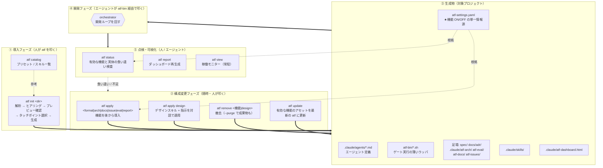
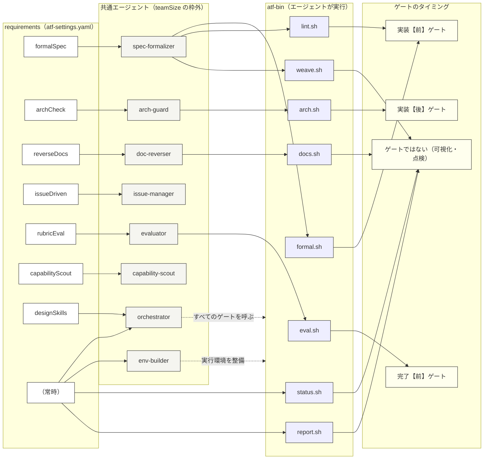
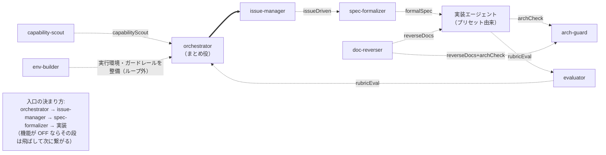
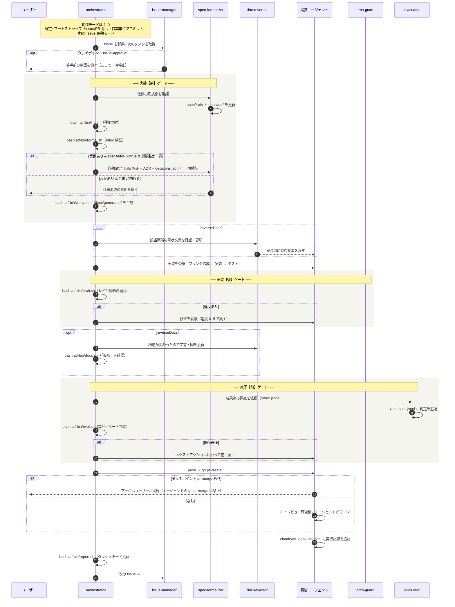
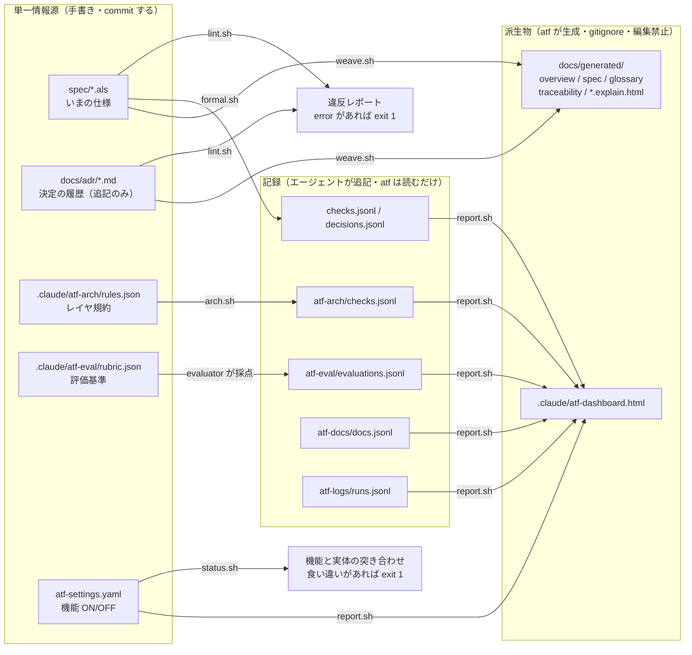

# atf — コマンドとエージェントの関係 / 実行タイミング

Mermaid 記法。VS Code の Mermaid プレビュー、または GitHub の ```mermaid フェンスで描画できる。

---

## 1. 全体ライフサイクル — どのコマンドがいつ走るか



---

## 2. 機能 → エージェント → 実行スクリプト → ゲートの対応

`atf-settings.yaml` の `requirements` が ON のときだけ、担当エージェント・足場・`atf-bin/*.sh` が配られる。



| 機能 | 担当エージェント | スクリプト | 実行タイミング |
|---|---|---|---|
| formal（形式仕様 Alloy） | spec-formalizer | `lint.sh` → `formal.sh` → `weave.sh` | **実装前**（通るまで実装を委譲しない） |
| arch（適合検証） | arch-guard | `arch.sh` | **実装後**（違反を残して完了としない） |
| docs（リバースドキュメント） | doc-reverser | `docs.sh` | 実装**前**に読む / 構造変更**後**に更新 |
| issue（Issue 駆動） | issue-manager | なし（進め方の機能） | ループの入口 |
| eval（ルーブリック評価） | evaluator | `eval.sh` | **完了前**（採点は evaluator、集計は atf） |
| capability（最新機能スカウト） | capability-scout | なし | 随時（orchestrator へ採否表と計画書） |
| report（ダッシュボード） | — | `report.sh` | 随時 |
| （常時） | orchestrator / env-builder | `status.sh` | 随時 |

---

## 3. エージェント間のフロー（buildFlow が組み立てる辺）

`firstAgent` = プリセット先頭の実装エージェント。破線は機能が ON のときだけ現れる辺。



---

## 4. 開発 1 サイクルの実行タイミング（Issue 駆動モード）



---

## 5. 情報源と生成物の依存（SSOT の向き）


